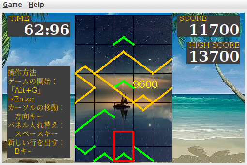
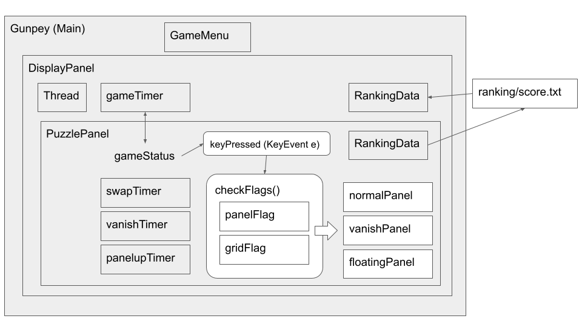

# Gunpey

## 概要

つなげて消すのがグンペイだ! で有名なGunpey をJava のSwing を用いて再現してみました。
上下にパネルを入れ替えてラインを左から右につなげてライン消します。
パネルが最上部より出るか時間切れになるかでゲームオーバーです。
ゲームオーバーまでのスコアを競ってください。
一度に消すパネルの量が多ければ多いほど点数が高くなります。
詳細は[参考](https://github.com/kimushun1101/gunpey#参考)のセクションをご参照ください。



## プレイ方法

### Java のインストール

[こちら](https://www.java.com/ja/download/help/download_options.html)をご参照ください。
端的にいえば[ここ](https://www.java.com/ja/download/manual.jsp)からダウンロードできます。

Ubuntu などapt を使用できる場合にはターミナルでインストールすると良いでしょう。
```
$ sudo apt update
$ sudo apt install default-jdk -y
```

### 実行

Gunpey.jar をダブルクリック、もしくはターミナルで
```
$ java -jar Gunpey.jar
```
とすることで実行できます。

## プログラムの改変とコンパイル

### コンパイル方法

コンパイルするためにはJava の種類をjre ではなくjdk でインストールしてください。
お好きなエディタで編集してしてから以下で実行。
```
$ javac -encoding UTF-8 *.java
$ java Gunpey
```
jar ファイルを作成したい場合には
```
$ jar cfe Gunpey.jar Gunpey *.class LICENSE
```
### 音源の追加

sounds ディレクトリを作成して以下のファイルを追加してください。
ゲームBGM はマルチプラットフォームでテストできておりません。
wav に関しては[魔王魂様の効果音](https://maou.audio/category/se/) を使わせていただきテストしました。
.gitignore で設定してGithub 上にはアップロードを控えさせていただいております。二次配布可能な音源などありましたら教えていただけますと幸いです。

- bgm.mid : ゲームBGM
- swap.wav : パネル入れ替え時の音
- connect.wav : ライン結合時の音
- vanish.wav : ライン消去時の音
- panelup.wav : パネルせり上がり時の音


## プログラムの中身について

クラスや変数のイメージは下図の通りです。



### 時間の管理 

タイマを管理するクラス(TimeFlag.java)を作って大量生産しました。
設定時間が経過するとTimeFlag のprivate変数であるflagがtrueになります。
- gameTimer : ゲーム自体の制限時間のタイマ
- vanishTimer : パネルがつながれてから消えるまでのタイマ
- swapTimer : パネルの入れ替え時間のタイマ
- panelupTimer : 新しい列が出るまでの時間のタイマ

### パネル集合の種類と表示の仕方 

以下の３種類をパネルの配列として用意しました。

- normalPanel : 通常のパネル
- vanishPanel : 消滅中のパネル
- floatingPanel : 消滅中のパネルの上にあるパネル

normalPanel を緑色で表示、vanishPanel を黄色で表示、floatingPanel は緑色で位置をずらして表示します。


### 消える判定のためのフラグ 

ラインがつながっているかどうかを判定するために、

- panelFlag : パネルの状態
- gridFlag : パネルの頂点の状態

を用意して再帰関数で処理しています。
左端から右へ伝搬させる処理と右端から左へ伝搬させる処理を両方行い、折り返して接続されているようなラインに対しても正確に判定します。

### スコアの管理

RankingData クラスを作成して、ranking/score.txt を読み書きしています。
ゲームオーバーになると、そのゲームでのスコアを追加、降順にソートされて格納し直します。ハイスコアを取り出したい場合にはソート済みの先頭のスコアを取り出してくる仕組みです。


### 既知の課題

プログラムが複雑になりそうでしたので以下を放置してます。

- Help のURL リンクの対応。
- 音出力にApplet を用いている（現在は非推奨）。


## 参考

- [グンペイホームページ](http://www.bandaigames.channel.or.jp/list/gunpey/ )
：おそらくここが本家ページです。
- [gunpey maniax](http://www.asahi-net.or.jp/~VG5M-OBT/gunpey_maniax.html )
：得点計算の参考にさせていただきました。

## ライセンス等

ソースコードはMIT License としました。
画像は[Pixabay](https://pixabay.com/ja/service/license/) で検索したものを使用させていただいております。
アイコンは公式を模倣した私の自作です。